# Environmental and Social Management System (ESMS) Implementation Handbook

**FOR GK AND A LOGISTICS SERVICES LTD**

_Version 1.0 - October 2025_

---

## Table of Contents

- [Environmental and Social Management System (ESMS) Implementation Handbook](#environmental-and-social-management-system-esms-implementation-handbook)
  - [Table of Contents](#table-of-contents)
  - [Welcome \& How to Use This Handbook](#welcome--how-to-use-this-handbook)
    - [Environmental and Social Responsibility at GK and A Logistics Services Ltd](#environmental-and-social-responsibility-at-gk-and-a-logistics-services-ltd)
    - [How to Use This Handbook](#how-to-use-this-handbook)
  - [Section I: Benefits of an Environmental and Social Management System](#section-i-benefits-of-an-environmental-and-social-management-system)
    - [Benefits for GK and A Logistics Services Ltd](#benefits-for-gk-and-a-logistics-services-ltd)
    - [Business Benefits](#business-benefits)
  - [Section II: Understanding an Environmental and Social Management System](#section-ii-understanding-an-environmental-and-social-management-system)
    - [Overview](#overview)
    - [Elements of an Environmental and Social Management System (ESMS)](#elements-of-an-environmental-and-social-management-system-esms)
    - [System Development and System Implementation](#system-development-and-system-implementation)
    - [Integration with Existing Management Systems](#integration-with-existing-management-systems)
  - [Section III: Practical Guidelines for Developing and Implementing Your ESMS](#section-iii-practical-guidelines-for-developing-and-implementing-your-esms)
    - [1. Policy](#1-policy)
      - [Purpose of an Effective Policy](#purpose-of-an-effective-policy)
      - [GK and A Logistics Services Ltd Environmental and Social Policy Statement](#gk-and-a-logistics-services-ltd-environmental-and-social-policy-statement)
      - [Gaining Senior Management Commitment](#gaining-senior-management-commitment)
      - [Integration with Existing Corporate Policies](#integration-with-existing-corporate-policies)
    - [2. Identification of Risks and Impacts](#2-identification-of-risks-and-impacts)
      - [General Environmental and Social Risks](#general-environmental-and-social-risks)
      - [Risk Assessment Methodology](#risk-assessment-methodology)
    - [3. Management Programs](#3-management-programs)
      - [Identifying Preventive and Corrective Actions](#identifying-preventive-and-corrective-actions)
      - [Writing an Effective Action Plan](#writing-an-effective-action-plan)
      - [Writing Effective Procedures for Maritime Logistics Operations](#writing-effective-procedures-for-maritime-logistics-operations)
      - [Short Cases](#short-cases)
    - [4. Organizational Capacity and Competency](#4-organizational-capacity-and-competency)
      - [Roles, Responsibilities, and Authorities](#roles-responsibilities-and-authorities)
      - [Communication and Training](#communication-and-training)
    - [5. Emergency Preparedness and Response](#5-emergency-preparedness-and-response)
      - [OHS Hazards and Emergency Situations](#ohs-hazards-and-emergency-situations)
      - [Emergency Preparedness Plan](#emergency-preparedness-plan)
      - [Port-Specific Emergency Response Procedures](#port-specific-emergency-response-procedures)
    - [6. Stakeholder Engagement](#6-stakeholder-engagement)
      - [Mapping Our Stakeholders](#mapping-our-stakeholders)
      - [Developing a Stakeholder Engagement Plan](#developing-a-stakeholder-engagement-plan)
    - [7. External Communications and Grievance Mechanisms](#7-external-communications-and-grievance-mechanisms)
      - [External Communications](#external-communications)
      - [Grievance Mechanism](#grievance-mechanism)
      - [Designing Effective Grievance Mechanisms](#designing-effective-grievance-mechanisms)
    - [8. Ongoing Reporting to Affected Communities](#8-ongoing-reporting-to-affected-communities)
    - [9. Monitoring and Review](#9-monitoring-and-review)
      - [Indicators](#indicators)
      - [Measuring and Improving Our ESMS](#measuring-and-improving-our-esms)
      - [Conducting Effective Management Reviews](#conducting-effective-management-reviews)
      - [Detailed Monitoring Methods for Maritime Logistics Operations](#detailed-monitoring-methods-for-maritime-logistics-operations)
  - [Conclusion](#conclusion)
  - [Appendices](#appendices)
    - [Appendix A: Relevant Laws and Regulations](#appendix-a-relevant-laws-and-regulations)
    - [Appendix B: International Standards](#appendix-b-international-standards)
    - [Appendix C: Key Performance Indicators](#appendix-c-key-performance-indicators)
    - [Appendix D: Emergency Contact Information](#appendix-d-emergency-contact-information)
    - [Appendix E: Risk Assessment Methodology](#appendix-e-risk-assessment-methodology)
    - [Appendix F: Procedure Writing Standards](#appendix-f-procedure-writing-standards)
    - [Appendix G: Grievance Mechanism Design Framework](#appendix-g-grievance-mechanism-design-framework)
    - [Appendix H: Nigerian Regulatory Bodies](#appendix-h-nigerian-regulatory-bodies)

---

## Welcome & How to Use This Handbook

### Environmental and Social Responsibility at GK and A Logistics Services Ltd

Environmental and social responsibility is becoming increasingly important in today's global economy. As a leading maritime infrastructure and logistics development company in Nigeria, GK and A Logistics Services Ltd is committed to reshaping how goods move across the country through efficient, sustainable, and economically impactful inland port solutions.

This Environmental and Social Management System (ESMS) Implementation Handbook is designed specifically for GK and A Logistics Services Ltd to help integrate environmental and social considerations into our core business operations. The handbook provides practical guidance to help us develop and implement an ESMS that will improve our overall operations while ensuring compliance with Nigerian laws, international standards, and our ESG commitments.

### How to Use This Handbook

This handbook is structured into three main sections:

1. **Section I** provides background on the benefits of implementing an ESMS for a logistics company like GK and A Logistics Services Ltd.
2. **Section II** explains the fundamental concepts and elements of an ESMS, including the distinction between system development and implementation.
3. **Section III** offers step-by-step instructions on how to develop and implement each element of the ESMS, specifically tailored to GK and A Logistics Services Ltd' operations.

Each element in Section III includes:
- A brief explanation of the element
- Maturity rating criteria to assess current performance
- Practical guidelines for implementation
- References to relevant tools and templates

---

## Section I: Benefits of an Environmental and Social Management System

### Benefits for GK and A Logistics Services Ltd

As a maritime logistics company operating in Nigeria's strategic Ikorodu region, GK and A Logistics Services Ltd faces several environmental and social challenges. None of these challenges are insurmountable, but if not effectively assessed and managed, they could hurt our profitability, reputation, and prospects for future business.

Among these challenges are:
- Increasing energy and raw materials costs
- Growing power and influence of environmental and labor regulatory agencies in Nigeria
- Rapidly evolving consumer awareness and concerns about environmental and social issues
- Compliance with international standards (BS EN, ISO) and Nigerian regulations
- Meeting the expectations of international partners and investors

### Business Benefits

Implementing an ESMS can provide direct business benefits for GK and A Logistics Services Ltd:

1. **Cost Reduction**: Conserving and using energy and materials more efficiently helps reduce production costs. Reducing waste and discharges, and recycling can minimize waste disposal costs.

2. **Operational Efficiency**: Effective occupational health and safety management procedures will help identify workplace hazards, reduce injuries and fatalities, and lead to bottom-line benefits such as reduced absenteeism and worker turnover.

3. **Compliance**: Ensuring compliance with Nigerian laws (Labour Act, Factories Act, Employees' Compensation Act 2010, etc.) and international standards.

4. **Reputation**: Building trust with local communities, government agencies, and international partners.

5. **Competitive Advantage**: Demonstrating our commitment to sustainability can differentiate us in the marketplace and attract environmentally and socially conscious clients.

---

## Section II: Understanding an Environmental and Social Management System

### Overview

A management system is a set of processes and practices to consistently implement company policies to meet business objectives. For GK and A Logistics Services Ltd, our ESMS will help us assess and control environmental and social risks related to our port terminal operations, cargo handling, and logistics services.

The key to lasting improvement is the idea of continual improvement through the Plan-Do-Check-Act (PDCA) cycle:

### Elements of an Environmental and Social Management System (ESMS)

A solid ESMS for GK and A Logistics Services Ltd is made up of nine interrelated elements:

### System Development and System Implementation

One of the most important things to understand about a management system is the difference between system development and system implementation. A management system is comprised of trained, committed people routinely following procedures. If you break this statement down, you see that it talks about "procedures." Procedures are the step-by-step way that people follow your policies. Procedures are the heart of effective system development.

Now let's look at the other part of the statement – "trained, committed people routinely following procedures." This is the implementation. There is a lot that goes into making it happen. Of course, some training is important to make sure that people are aware of the procedures and understand what they are supposed to do on a routine basis. But you also need to find a way to get their commitment.

One common observation is that large companies tend to be better at system development. But they often have difficulty getting people in different locations or departments to consistently implement the procedures, despite having well-documented systems. Small companies tend to be better at system implementation – if they have effective leadership. However, they are often weak at developing the documentation needed to ensure continuity when people in the organization change.

The approach of this Handbook and its companion publications balances system development and system implementation in each of the ESMS elements.

**DEFINITIONS**

**System Development**: The documented policies and procedures.

**System Implementation**: Trained, committed people routinely following the procedures.

An ESMS does not need to be complicated, but it does need to be documented and then put into practice. Some people mistakenly think a management system is just documents. But that is only a part of it. Management systems are about implementation and continual improvement.

### Integration with Existing Management Systems

If GK and A Logistics Services Ltd already has existing management systems for quality or health and safety, this Handbook will help to expand them to include environmental and social performance. Our ESMS should be integrated with existing systems rather than operating in isolation. This integration will:

1. **Reduce Redundancy**: Avoid duplicating efforts and documentation
2. **Improve Efficiency**: Streamline processes and reporting
3. **Enhance Consistency**: Ensure aligned objectives and approaches
4. **Optimize Resources**: Make better use of personnel and financial resources

Key areas for integration include:
- Quality management systems (ISO 9001)
- Occupational health and safety management systems (ISO 45001)
- Financial management systems
- Human resources management systems
- Information technology systems

---

## Section III: Practical Guidelines for Developing and Implementing Your ESMS

### 1. Policy

#### Purpose of an Effective Policy

The cornerstone of our ESMS is our set of policies. Our policies summarize our commitment to managing environmental and social risks and impacts. They establish expectations for conduct in all aspects of our business.

#### GK and A Logistics Services Ltd Environmental and Social Policy Statement

GK and A Logistics Services Ltd is committed to providing world-class logistics solutions through the design, development, and operation of inland ports and related infrastructure that are efficient, sustainable, and economically impactful.

Our environmental and social policy commitments include:

1. **Legal Compliance**: Complying with all applicable Nigerian laws and regulations, including the Labour Act, Factories Act, Employees' Compensation Act 2010, Pension Reform Act 2014, and other relevant legislation.

2. **Worker Health and Safety**: Providing a safe and healthy workplace for all employees, contractors, and visitors at our facilities, including our NPA Lighter Terminal operations.

3. **Environmental Protection**: Minimizing our environmental impact through efficient resource use, waste reduction, and pollution prevention.

4. **Community Relations**: Engaging positively with local communities and stakeholders affected by our operations.

5. **Equal Opportunity**: Ensuring equal opportunity and non-discrimination in all employment practices.

6. **Continuous Improvement**: Continually improving our environmental and social performance through regular monitoring, review, and system enhancement.

7. **Supply Chain Responsibility**: Ensuring our suppliers and contractors adhere to our environmental and social standards.

#### Gaining Senior Management Commitment

Our senior management is committed to the successful implementation of this ESMS. The Managing Director serves as the executive sponsor, with the Head of HR as policy custodian and the HSE Manager responsible for enforcing safety provisions.

#### Integration with Existing Corporate Policies

Our ESMS policy should be integrated with existing corporate policies including:
- Quality policy
- Health and safety policy
- Human resources policy
- Financial management policy
- Information technology policy

This integration ensures consistency and alignment across all organizational functions.

### 2. Identification of Risks and Impacts

#### General Environmental and Social Risks

For GK and A Logistics Services Ltd, key environmental and social risks include:

**Environmental Risks:**
- Release of air pollutants (air emissions) from vehicles and equipment, leading to pollution of air, land, and surface water
- Release of liquid effluents or contaminated wastewater into local water bodies or improper wastewater treatment, causing surface water pollution
- Generation of large amounts of solid waste and improper waste management, resulting in pollution of land, ground, and surface water
- Improper management of hazardous substances, leading to contamination of adjacent land and water
- Excessive energy use, contributing to depletion of local energy sources and release of combustion residuals leading to air pollution
- Excessive water use, causing depletion of water resources
- High or excessive noise levels, resulting in negative effects on human health and disruption of local wildlife
- Improper or excessive land use, leading to soil degradation and biodiversity loss

**Occupational Health and Safety Risks:**
- Physical hazards such as slips, trips, and falls, causing worker injury (sprains, strains, fractures)
- Falls when working at heights, leading to worker injury or loss of life (fractures, life-threatening trauma)
- Collision with moving equipment (vehicles, fork lifts, cranes), resulting in worker injury or loss of life (life-threatening trauma)
- Caught in by improperly enclosed, unguarded or moving machinery, causing worker injury or loss of life (cuts, traumatic amputation)
- Exposure to high or excessive noise levels, leading to loss of hearing
- Exposure to extreme temperatures, causing hypothermia, heat stress, dehydration
- Contact with exposed or faulty electrical wires, resulting in worker injury or loss of life (electrocution)
- Explosions or fire due to ignition of dust or flammable materials, leading to worker injury or loss of life (asphyxiation, burnings)
- Exposure to ionizing radiation (x-rays), causing worker injury or loss of life (skin lesions, radiation sickness, cancer)
- Exposure to non-ionizing radiation (ultraviolet, visible light), resulting in worker injury or loss of life (burns, blindness, skin cancer)
- Chemical hazards such as inhalation, skin contact, or ingestion of hazardous chemicals (e.g., pesticides, solvents), leading to worker injury or loss of life (irritation, damage to internal organs, intoxication)
- Inhalation of dust, causing worker illness (decreased lung capacity)
- Exposure to hazardous atmosphere in confined spaces, resulting in worker loss of life (asphyxiation)
- Biological hazards including exposure to blood or bodily fluids from persons or animals carrying pathogens, causing worker illness or loss of life
- Exposure to airborne or vector-borne diseases (bacteria, viruses or mold/fungi), leading to worker illness or loss of life
- Exposure to poisonous plants, animals or insects, resulting in worker illness or loss of life
- Lack of appropriate welfare facilities (e.g., potable water, toilets, washing facilities), causing worker ill-health
- Ergonomic hazards such as repetitive motions, leading to worker injury (strains and sprains to muscles and connective tissues causing pain, inflammation, numbness or loss of muscle function)
- Improper techniques for lifting heavy items, causing worker injury
- Improperly designed or aligned work stations, leading to worker injury
- Standing for long periods of time, causing worker injury

**Labor and Social Risks:**
- Lack of contracts, use of contracts not understood by workers, or use of contracts with terms that are different from actual working conditions, leading to forced labor
- Exploitation of migrant or temporary workers by labor contractors, including unlawful wage deductions (e.g., excessive recruitment fees, transportation/housing costs), resulting in forced labor
- Low or insufficient wages, leading to excessive overtime and perpetuation of poverty cycle for workers (which can also lead to child labor)
- Excessive overtime, causing worker fatigue leading to higher injury rates and illnesses
- Exploitation of young workers or student workers, resulting in child labor
- Lack of freedom of association or grievance mechanisms, leading to mistreatment of workers and workers with no ability to voice concerns or submit complaints
- Discriminatory hiring and promotion practices, causing negative work environment and unequal access to opportunities and benefits
- Verbal and physical (sexual) harassment, leading to worker dissatisfaction and trauma
- Unsafe and unhygienic living quarters for workers, causing workers ill-health

**Community Health, Safety, and Security Risks:**
- Release of pollutants and harmful dust into ambient air, leading to negative impacts on the community's health
- Surface or drinking water contamination, causing negative impacts on the community's health
- Strain on local water supply, leading to conflicts among competing water users
- Exposure to hazardous substances, resulting in negative impacts on the community's health
- Spread of diseases due to the influx of workers, causing negative impacts on the community's health
- Increase of disease vectors (e.g., mosquitoes, flies, rodents) from failure to manage liquid and solid wastes, leading to negative impacts on the community's health
- Release of unpleasant odors, causing negative impacts on the community's health
- Excessive noise, resulting in negative impacts on the community's health
- Improperly controlled or trained security guards, leading to violence against local community members
- Excessive or unregulated vehicle traffic near the facility and through communities at inappropriate times (e.g., children going to school), causing injury/death of community members due to vehicular accidents
- Poorly designed and constructed buildings and infrastructure, leading to injury/death of community members and damage to neighboring properties

#### Risk Assessment Methodology

Our risk assessment methodology follows a systematic approach to identify, analyze, and evaluate environmental and social risks:

1. **Risk Identification**: Systematic identification of potential environmental and social risks across all our activities using techniques such as:
   - Process mapping
   - Physical mapping
   - Checklists
   - Interviews with workers and managers
   - Review of incident records
   - Consultation with external stakeholders

2. **Risk Analysis**: Detailed analysis of identified risks to determine:
   - Likelihood of occurrence
   - Severity of consequences
   - Vulnerability of affected parties
   - Effectiveness of existing controls

3. **Risk Evaluation**: Comparison of risks against established criteria to determine significance:
   - Use of risk matrices (probability x consequence)
   - Consideration of legal and regulatory requirements
   - Stakeholder concerns and expectations
   - Company risk appetite

4. **Risk Prioritization**: Ranking of risks based on significance to focus resources on the most critical issues.

5. **Risk Treatment**: Development of action plans to:
   - Avoid risks where possible
   - Minimize risks that cannot be avoided
   - Offset/compensate for residual risks

See Appendix E for detailed Risk Assessment Methodology.

### 3. Management Programs

#### Identifying Preventive and Corrective Actions

Our approach to managing environmental and social risks follows the mitigation hierarchy:
1. **Avoid** - Preventing negative impacts where possible
2. **Minimize** - Reducing the severity of impacts that cannot be avoided
3. **Offset/Compensate** - Addressing residual impacts through compensation or restoration

#### Writing an Effective Action Plan

For each identified risk, we will develop action plans that specify:
- What risks we want to address
- How we will address them through specific actions and procedures
- Why these actions are necessary (objectives and expected results)
- When actions will be implemented (timelines and deadlines)
- Who is responsible for implementation

#### Writing Effective Procedures for Maritime Logistics Operations

Procedures serve as step-by-step instructions for workers, supervisors and managers. They allow for everyone to have a common understanding of how to behave. They enable the rules to be followed even when there is staff turnover. Clear, detailed procedures help to embed our social and environmental policies into our daily operations.

It is a good practice to document our procedures. The key is to make our procedures as clear and as brief as possible. We can use text, checklists, flowcharts, or simple illustrations. The format for our procedure can vary depending on the audience. A written procedure may be more appropriate for managers and supervisors, while illustrations may be useful when dealing with less literate or immigrant workers.

Simply documenting a procedure is not enough. Effective implementation is the ultimate goal. Most importantly, employees need to be aware that a new procedure exists and understand why it is important to follow. They need the skills and knowledge to be able to implement it. This is achieved through routine communication and effective training.

Finally, we must ensure that our employees have access to the current version of each procedure. Out-of-date documentation should be removed or clearly marked as outdated to ensure that no one unintentionally follows the old procedure.

Our procedure writing standards include:
- Clear, concise language
- Step-by-step instructions
- Visual aids where appropriate
- Defined roles and responsibilities
- Performance criteria
- Review and update schedules

See Appendix F for detailed Procedure Writing Standards.

#### Short Cases

Here we present several short cases that illustrate some of the actions that companies in the logistics and infrastructure sector can take to avoid, minimize or offset common environmental and social key risks. Action Plans can be scaled to the size of your company and the nature of the risks you face.

**Logistics Terminal Company**

**RISK: Use of large amounts of freshwater**

**IMPACT**
• Shortages of water for local communities

**AVOID**
• Relocate operations to an area with higher availability of surface waters

**MINIMIZE**
• Conduct a water audit: install water meters, collect data for 5-10 days, and compare with operational needs to detect problems
• Assess water usage in cleaning processes and minimize losses from equipment
• Install low volume cleaning systems to reduce water consumption
• Dry clean yards to maximum feasible extent; collect waste for proper disposal
• Store water used for cleaning in treatment storage and recycle for yard washing or irrigation

**OFFSET**
• Engage with local communities and NGOs to rehabilitate local water sources and promote rainwater harvesting technologies
• Distribute purchased potable water to affected communities during dry seasons; provide containers for storage

**CASE STUDY: NIGERIA**

A medium-sized logistics terminal in Lagos faced complaints from local communities about water shortages due to high water consumption. The company implemented water audits, installed efficient cleaning systems, and collaborated with community leaders to improve local water infrastructure, resolving conflicts and enhancing community relations.

**Port Operations Company**

**RISK: Discharge of untreated or ineffectively treated wastewater**

**IMPACT**
• Contamination of surface water/downstream river

**AVOID**
• Replace use of toxic or hazardous substances that may contaminate wastewater
• Adequately treat industrial wastewater and find alternative applications for the treated wastewater instead of discharging to surface waters

**MINIMIZE**
• Optimize effective wastewater treatment by evaluating and improving operations
• Minimize fluctuating loads on treatment plants by having collection and equalization systems
• Install interlocking systems to ensure shutdown during malfunctions
• Analyze treated wastewater for compliance before discharge
• Consider separate treatment facilities for contaminated streams

**OFFSET**
• Engage in active consultation with local communities, regulators and NGOs to address water concerns in the region

**CASE STUDY: LAGOS**

A port operations company in Lagos generated significant wastewater from cleaning processes. By optimizing treatment plants, minimizing loads, and engaging with communities, they reduced contamination and improved environmental compliance.

**Construction and Infrastructure Company**

**RISK: Construction waste disposal**

**IMPACT**
• Improper disposal causing land contamination and impacting local community

**AVOID**
• Establish and implement a construction waste management plan for all sites
• Establish procedures for reuse, recycle, and safe disposal to licensed landfills
• Train workers on proper handling and disposal of construction wastes
• Locate and remove hazardous facilities prior to commencement of work
• Implement rodent elimination programs prior to demolition
• Conduct surveys for hazardous materials and prepare remediation plans

**MINIMIZE**
• Develop grievance mechanisms for local residents to facilitate understanding of impacts
• Deploy containers for collection and safe disposal of solid waste

**OFFSET**
• Compensate local residents negatively affected by activities
• Provide health-related examinations for individuals claiming harm

**CASE STUDY: IKORODU**

During construction of terminal facilities in Ikorodu, a company implemented comprehensive waste management plans, trained workers, and engaged communities, minimizing environmental impacts and maintaining positive relations.

**Logistics Fleet Company**

**RISK: Worker exposure to hazardous materials**

**IMPACT**
• Negative health impacts on workers

**AVOID**
• Obtain Material Safety Data Sheets (MSDS) from suppliers to learn about composition and hazards; select materials with lowest toxicity

**MINIMIZE**
• Install ventilation systems and maintain them regularly
• Develop procedures for proper handling and maintenance to reduce contamination
• Provide appropriate protective equipment free of charge
• Place washing stations close to work areas
• Install emergency showers near working areas
• Regularly assess workers' exposure and conduct medical screenings
• Maintain records of accidents and conduct root-cause analysis

**OFFSET**
• Provide medical care and assistance to affected workers
• Compensate for work-related health impacts according to regulations

**CASE STUDY: NIGERIA**

A logistics company in Nigeria improved worker safety by implementing ventilation systems, providing PPE, and conducting regular health screenings, reducing exposure incidents and improving employee satisfaction.

### 4. Organizational Capacity and Competency

#### Roles, Responsibilities, and Authorities

Our ESMS implementation team includes:
- **Executive Sponsor**: Managing Director
- **Policy Custodian**: Head of HR
- **HSE Manager**: Responsible for health, safety, and environmental compliance
- **Line Managers**: Accountable for day-to-day implementation in their areas
- **Worker Representatives**: Providing input from operational staff

#### Communication and Training

We will ensure all employees receive:
- Initial ESMS awareness training during onboarding
- Annual refresher training on relevant ESMS elements
- Specialized training for personnel with specific ESMS responsibilities
- Training in the local language for all workers

### 5. Emergency Preparedness and Response

#### OHS Hazards and Emergency Situations

Key emergency scenarios for GK and A Logistics Services Ltd include:
- Fire emergencies at our terminal facilities
- Chemical spills or hazardous material releases
- Vehicle accidents involving our fleet or at our facilities
- Medical emergencies among workers or visitors
- Natural disasters (flooding, storms)
- Security incidents
- Container collapse or falling cargo
- Electrical emergencies
- Mechanical equipment failures
- Structural failures

#### Emergency Preparedness Plan

Our emergency preparedness plan includes:
- Identification of potential emergencies based on hazard assessment
- Detailed response procedures for each identified emergency
- Equipment shutdown procedures
- Rescue and evacuation procedures
- List and location of alarms and emergency equipment
- Communication protocols during emergencies
- Regular training and drills for all personnel

#### Port-Specific Emergency Response Procedures

**1. Fire Emergency Response Procedure**
- Discover fire and activate nearest fire alarm immediately
- Call emergency services (112) and report fire location, size, and type of materials involved
- If safe to do so, attempt to extinguish small fires with appropriate extinguisher
- Evacuate area following designated evacuation routes, avoiding smoke
- Report to designated assembly point and account for all personnel
- Do not re-enter building until declared safe by emergency services
- Coordinate with NPA fire response team if incident involves port infrastructure

**2. Chemical Spill Response Procedure**
- Alert nearby personnel and evacuate immediate area (100m radius minimum)
- Notify HSE Manager and emergency response team immediately
- If safe, stop source of spill if possible (close valves, upright containers)
- Contain spill using spill kits and absorbent materials to prevent spread
- Prevent spill from reaching drains, waterways, or soil
- Use appropriate PPE when cleaning up spill (chemical suits, respirators, gloves)
- Dispose of contaminated materials according to hazardous waste procedures
- Document incident with photos, witness statements, and review procedures

**3. Container Collapse/Falling Cargo Response Procedure**
- Immediately stop all crane and cargo handling operations in the area
- Alert terminal supervisor and HSE Manager
- Establish safety perimeter around fallen containers (minimum 50m radius)
- Check for injuries and provide first aid if needed
- Assess structural integrity of nearby stacked containers
- If hazardous materials are involved, follow chemical spill procedures
- Coordinate with crane operators and riggers for safe removal
- Document incident and conduct root cause analysis

**4. Maritime Vessel Emergency Response Procedure**
- Establish communication with vessel crew immediately
- Alert NPA and Nigerian Inland Waterways Authority
- Deploy emergency response team to waterfront areas
- Prepare for potential evacuation of vessel personnel to shore
- Establish safety zones around the vessel
- Coordinate with emergency services (fire, medical, coast guard)
- If hazardous cargo is involved, implement appropriate containment measures
- Document all actions taken and communications

**5. Flooding/Storm Emergency Response Procedure**
- Monitor weather forecasts and tidal conditions regularly
- Secure all loose equipment and cargo
- Move critical equipment to higher ground if possible
- Close watertight doors and seal openings
- Activate sump pumps and drainage systems
- Evacuate low-lying areas to higher ground
- Establish communication with emergency services and NPA
- Document water levels and damage for insurance purposes

**6. Security Breach/Intrusion Response Procedure**
- Notify security personnel and terminal supervisor immediately
- Activate security alarm system
- Lock down affected areas
- Do not confront armed intruders directly
- Coordinate with Nigerian security forces
- Secure sensitive areas and cargo
- Document incident details and preserve evidence
- Review security protocols and implement improvements

### 6. Stakeholder Engagement

#### Mapping Our Stakeholders

Key stakeholders for GK and A Logistics Services Ltd include:
- **Internal Stakeholders**: Employees, contractors, management
- **Local Communities**: Residents of Ikorodu and surrounding areas
- **Government Agencies**: NPA, NIWA, Lagos State authorities
- **Business Partners**: Shipping lines, freight forwarders, customs agents
- **Regulatory Bodies**: The following regulatory agencies are highly relevant to GK and A Logistics Services Ltd's maritime logistics and inland port operations:
  - Nigerian Ports Authority (NPA) - Port operations and marine infrastructure regulation
  - Nigerian Maritime Administration and Safety Agency (NIMASA) - Maritime safety, shipping, and security
  - Nigerian Inland Waterways Authority (NIWA) - Inland waterways and port operations regulation
  - Federal Ministry of Transportation (FMOT) - National transportation sector oversight
  - Lagos State Ministry of Transportation - Lagos State transportation regulation
  - Infrastructure Concession Regulatory Commission (ICRC) - Public-private partnerships and concessions
  - Bureau of Public Procurement (BPP) - Public procurement and contracting regulation
  - Nigerian Environmental Standards and Regulations Enforcement Agency (NESREA) - Environmental standards and compliance
  - Lagos State Environmental Protection Agency (LASEPA) - State-level environmental regulation in Lagos
  - Federal Ministry of Environment (FMEnv) - National environmental policy and regulations
  - Nigerian Customs Service - Customs and border control operations
  - Pension Commission (PENCOM) - Pension scheme regulation and enforcement
  - Federal Ministry of Labour and Employment - Labor laws and worker protections
- **Investors and Lenders**: Financial institutions supporting our projects
- **NGOs and Civil Society**: Environmental and community organizations

#### Developing a Stakeholder Engagement Plan

We will engage stakeholders through:
- Regular community meetings
- Consultations during project development
- Information sharing through multiple channels
- Feedback mechanisms for concerns and suggestions
- Participation in local development initiatives

### 7. External Communications and Grievance Mechanisms

#### External Communications

We maintain publicly accessible channels for stakeholder communication:
- Company website: https://gkaports.com/
- Email: info@gkaports.com
- Phone: +2348181927251
- Physical address: NPA Lighter Terminal, Ikorodu, Lagos, Nigeria

#### Grievance Mechanism

Our grievance mechanism allows stakeholders to:
- Raise questions, concerns, or complaints anonymously if desired
- Receive acknowledgment of their concerns within 24 hours
- Have grievances investigated and resolved within established timeframes
- Receive feedback on the outcome of their concerns

#### Designing Effective Grievance Mechanisms

A well-designed grievance mechanism is essential for effective stakeholder engagement and continuous improvement of our ESMS. Our grievance mechanism should be:

**UNDERSTANDABLE AND TRUSTED** when:
- Affected communities understand the procedure to handle a complaint
- People are aware of the expected response time
- Confidentiality of the person raising the complaint is protected

**CULTURALLY APPROPRIATE AND ACCESSIBLE** when:
- Claims can be presented in the local language
- Technology required to present a claim is commonly used (e.g., paper, text messaging, internet)
- Illiterate persons can present verbal complaints

**AT NO COST** when:
- People don't need to travel long distances to present a claim
- The company covers the costs of third party facilitation

Key design principles for our grievance mechanism include:
1. **Scalability**: Fit the level and complexity of social and environmental risks and impacts identified in our company
2. **Accessibility**: Easy to understand, accessible, trusted and culturally appropriate
3. **Transparency**: Publicize the availability of the grievance procedure so people know where to go and whom to approach
4. **Responsiveness**: Commit to response times and keep to them to increase transparency and a sense of "fair process"
5. **Documentation**: Keep records of each step to create a "paper trail"
6. **Independence**: The more serious the claim, the more independent the mechanism should be to determine resolution and options for redress

See Appendix G for detailed Grievance Mechanism Design Framework.

### 8. Ongoing Reporting to Affected Communities

We commit to regular communication with affected communities:
- Annual community reports on our environmental and social performance
- Updates on project developments and their potential impacts
- Information on benefits generated by our operations
- Transparent reporting on any incidents or issues

### 9. Monitoring and Review

#### Indicators

We will track key performance indicators including:
- **Environmental Indicators**: Energy consumption, water usage, waste generation
- **Health and Safety Indicators**: Incident rates, near misses, training completion
- **Social Indicators**: Community engagement activities, local employment
- **Compliance Indicators**: Regulatory compliance status, audit results

#### Measuring and Improving Our ESMS

We will conduct regular assessments of our ESMS maturity and implement improvements through:
- Semi-annual internal audits
- Annual management reviews
- Regular stakeholder feedback collection
- Continuous improvement initiatives

#### Conducting Effective Management Reviews

Our senior management will conduct ESMS management reviews:
- **Frequency**: At least annually, or more frequently if needed
- **Participants**: Managing Director, Head of HR, HSE Manager, and relevant department heads
- **Agenda Items**: Progress on action plans, compliance status, performance indicators, resource needs
- **Outcomes**: Decisions on improvements, resource allocation, and policy updates

#### Detailed Monitoring Methods for Maritime Logistics Operations

Effective monitoring uses multiple methods tailored to our maritime logistics operations:

**1. Visual Observation**
Regular physical walk-throughs of our facilities and surrounding areas to observe:
- Fire detection, alarm and fighting equipment condition and accessibility
- Proper use of personal protective equipment (PPE) by workers
- Warning signs placement and visibility
- Storage of hazardous materials in accordance with safety protocols
- Drinking water and sanitation facilities availability and condition
- Information displayed on notice boards (policies, regulations, safety notices)
- Worker and manager interactions and body language
- Housekeeping standards in operational areas
- Equipment maintenance and condition

**2. Interviews**
Structured consultations with workers, managers, and external stakeholders to discuss:
- Worker understanding of policies and procedures
- Impact of operations on workers and surrounding communities
- Ideas for improvement from operational staff
- Worker comfort level with filing complaints or raising concerns
- External stakeholder impact and satisfaction
- Suggestions for improving our environmental and social performance

**3. Measuring and Testing**
Using properly calibrated equipment to check:
- Water and energy consumption at facility level and per TEU handled
- Emissions to air from vehicles and equipment
- Liquid effluent quality and discharge volumes
- Noise decibel levels in operational and community areas
- Dust levels in cargo handling zones
- Ambient temperature in work environments
- Light levels in operational areas
- Fuel consumption for fleet vehicles and equipment

**4. Document Review**
Examining records and documentation including:
- Water and energy bills for consumption trends
- Waste disposal records and recycling reports
- Chemical use and discharge records
- Inspection records from internal and external audits
- OHS records including incident reports and near misses
- Complaints logs and resolution records
- Wage slips and time cards for compliance verification
- Policies and procedures for currency and adherence
- Training records for completion rates and effectiveness
- Maintenance logs for equipment and facilities
- Environmental monitoring reports

**5. Technology-Enhanced Monitoring**
Utilizing modern technology for more effective monitoring:
- IoT sensors for real-time environmental monitoring
- Digital reporting platforms for incident reporting
- Mobile applications for field data collection
- Automated dashboards for KPI tracking
- Integration with existing enterprise systems

---

## Conclusion

This ESMS Implementation Handbook provides the framework for GK and A Logistics Services Ltd to integrate environmental and social considerations into our business operations. By following the guidelines in this handbook, we will be able to:

1. Identify and manage our environmental and social risks effectively
2. Ensure compliance with applicable laws and regulations
3. Improve our operational efficiency and reduce costs
4. Enhance our reputation and stakeholder relationships
5. Contribute to sustainable development in Nigeria

The success of our ESMS depends on the commitment and participation of all employees, from senior management to operational staff. We encourage everyone to take ownership of their role in implementing and maintaining this system.

---

## Appendices

### Appendix A: Relevant Laws and Regulations

- Labour Act
- Factories Act
- Employees' Compensation Act 2010
- Pension Reform Act 2014
- Industrial Training Fund Act
- National Health Insurance Authority Act 2022
- Nigeria Data Protection Act 2023
- Environmental regulations applicable to port operations

### Appendix B: International Standards

- ILO Core Conventions
- ISO 14001 (Environmental Management)
- ISO 45001 (Occupational Health and Safety)
- BS EN standards for construction and infrastructure

### Appendix C: Key Performance Indicators

| Category | Indicator | Target | Frequency |
|----------|-----------|--------|-----------|
| Health & Safety | Total Recordable Injury Rate (TRIR) | < 2.0 | Monthly |
| Health & Safety | Lost Time Injury Frequency Rate (LTIFR) | < 1.0 | Monthly |
| Environment | Energy consumption per TEU handled | 10% reduction by 2026 | Quarterly |
| Environment | Waste diversion rate | > 75% | Quarterly |
| Social | % of workforce that are women in supervisory roles | > 35% by 2026 | Quarterly |
| Compliance | Regulatory compliance score | > 95% | Annually |

### Appendix D: Emergency Contact Information

- HSE Manager: +2348181927251
- First Aid: 112
- Fire Emergency: 112
- Police: 112
- Hospital: Lagoon Hospitals, 8 Marine Road, Apapa, Lagos (+234-9034136452)

### Appendix E: Risk Assessment Methodology

**E.1 Risk Identification Process**

Our risk identification process involves:
1. **Process Mapping**: Detailed mapping of all operational processes to identify potential risk points
2. **Physical Mapping**: Site mapping to identify environmental and social risk zones
3. **Checklist Reviews**: Systematic review using standardized checklists for each operational area
4. **Stakeholder Consultation**: Engagement with workers, community members, and other stakeholders
5. **Historical Data Review**: Analysis of past incidents, near misses, and complaints
6. **Regulatory Review**: Assessment of applicable legal and regulatory requirements

**E.2 Risk Analysis Framework**

For each identified risk, we conduct detailed analysis using the following framework:

**Likelihood Assessment (1-5 Scale)**:
- 1 (Rare): Unlikely to occur
- 2 (Unlikely): Possible but not expected
- 3 (Possible): May occur at some time
- 4 (Likely): Will probably occur in most circumstances
- 5 (Almost Certain): Expected to occur in most circumstances

**Consequence Assessment (1-5 Scale)**:
- 1 (Insignificant): Negligible impact
- 2 (Minor): Minor impact with limited consequences
- 3 (Moderate): Noticeable impact requiring corrective action
- 4 (Major): Significant impact with serious consequences
- 5 (Catastrophic): Severe impact with major consequences

**Risk Rating Calculation**:
Risk Score = Likelihood × Consequence

**Risk Rating Categories**:
- Low Risk: 1-5
- Medium Risk: 6-12
- High Risk: 13-25

**E.3 Risk Evaluation Criteria**

Risks are evaluated against the following criteria:
1. **Legal and Regulatory Compliance**: Risks that may result in non-compliance
2. **Stakeholder Concerns**: Risks that are of particular concern to stakeholders
3. **Business Impact**: Risks that may significantly impact business operations
4. **Reputation**: Risks that may damage company reputation
5. **Financial Impact**: Risks with significant financial implications

**E.4 Risk Treatment Hierarchy**

Our approach to risk treatment follows the mitigation hierarchy:
1. **Avoid**: Eliminate the risk by not engaging in the activity or changing the approach
2. **Minimize**: Reduce the likelihood or consequence of the risk
3. **Offset/Compensate**: Address residual impacts through compensation or restoration
4. **Transfer**: Share the risk with another party (e.g., through insurance)
5. **Accept**: Acknowledge and monitor the risk when other options are not feasible

### Appendix F: Procedure Writing Standards

**F.1 General Principles**

All procedures should adhere to the following principles:
1. **Clarity**: Use clear, simple language that is easily understood
2. **Consistency**: Follow standardized formats and terminology
3. **Completeness**: Include all necessary steps and information
4. **Accuracy**: Ensure technical accuracy and currency
5. **Usability**: Design for ease of use by intended audience

**F.2 Procedure Structure**

Each procedure should include:
1. **Title**: Clear, descriptive title
2. **Purpose**: Statement of why the procedure exists
3. **Scope**: Description of what the procedure covers and who it applies to
4. **Responsibilities**: Clear assignment of roles and responsibilities
5. **Procedure Steps**: Detailed, sequential steps with decision points
6. **References**: Links to related procedures, policies, and standards
7. **Revision History**: Record of changes and updates
8. **Approval**: Authorization for implementation

**F.3 Writing Guidelines**

**Language and Style**:
- Use active voice
- Use present tense
- Use specific, actionable verbs
- Avoid jargon and technical terms where possible
- Use consistent terminology throughout

**Formatting**:
- Use numbered steps for sequential actions
- Use bullet points for lists of items
- Use bold text for important warnings or cautions
- Use tables for complex information
- Include diagrams or flowcharts where helpful

**Content Requirements**:
- Include safety precautions and warnings
- Specify required tools, equipment, and materials
- Define performance criteria and quality standards
- Include troubleshooting guidance
- Specify documentation and record-keeping requirements

**F.4 Review and Approval Process**

All procedures must go through the following review and approval process:
1. **Draft**: Initial development by subject matter expert
2. **Review**: Technical review by relevant departments
3. **Approval**: Authorization by designated management
4. **Implementation**: Communication and training
5. **Monitoring**: Ongoing assessment of effectiveness
6. **Revision**: Regular updates based on feedback and changes

### Appendix G: Grievance Mechanism Design Framework

**G.1 Purpose and Scope**

The purpose of our grievance mechanism is to provide a fair, accessible, and effective means for stakeholders to raise concerns, seek resolution, and contribute to continuous improvement of our operations and ESMS.

**G.2 Key Design Principles**

1. **Legitimacy**: Operated by competent and authorized personnel
2. **Accessibility**: Easy to understand and use by all stakeholders
3. **Predictability**: Clear procedures and expected timeframes
4. **Equity**: Fair treatment of all parties involved
5. **Transparency**: Open communication about process and outcomes
6. **Rights-Compatible**: Respect for human rights and due process
7. **Continuous Learning**: Use of feedback for improvement

**G.3 Mechanism Components**

**1. Receipt and Registration**
- Multiple channels for submitting grievances (phone, email, website, in-person, anonymous)
- Immediate acknowledgment of receipt
- Unique reference number for tracking
- Secure registration system

**2. Categorization and Prioritization**
- Initial screening to determine validity and scope
- Categorization by type and severity
- Prioritization based on urgency and impact
- Assignment to appropriate personnel

**3. Investigation and Analysis**
- Thorough investigation of facts
- Consultation with relevant parties
- Analysis of root causes
- Assessment of potential impacts

**4. Response and Resolution**
- Timely communication with complainant
- Development of appropriate response options
- Implementation of agreed solutions
- Monitoring of resolution effectiveness

**5. Documentation and Reporting**
- Comprehensive record-keeping
- Regular reporting on grievance trends
- Analysis for systemic issues
- Integration with management review process

**G.4 Implementation Requirements**

**Personnel**:
- Designated grievance officers
- Trained staff for handling complaints
- Clear escalation procedures
- Regular competency development

**Resources**:
- Adequate funding for operation
- Appropriate technology and systems
- Physical space for meetings
- Translation services where needed

**Communication**:
- Public awareness of the mechanism
- Clear information on how to use it
- Regular updates on process improvements
- Annual reporting on performance

**G.5 Performance Monitoring**

Key performance indicators for our grievance mechanism include:
- Number of grievances received
- Response time to initial contact
- Resolution time for complaints
- Satisfaction rate of complainants
- Number of grievances leading to operational improvements
- Trends in types of grievances received

**G.6 Continuous Improvement**

Our grievance mechanism will be regularly reviewed and improved through:
- Annual effectiveness assessments
- Stakeholder feedback collection
- Benchmarking against best practices
- Integration of lessons learned
- Updates to procedures and processes

### Appendix H: Nigerian Regulatory Bodies

**H.1 Overview**

GK and A Logistics Services Ltd operates in Nigeria's maritime and inland port sector, which is subject to regulation by several federal agencies. This appendix provides an overview of the key regulatory bodies that are applicable to our operations, their roles, and how we ensure compliance with their requirements.

**H.2 Key Regulatory Bodies**

**1. Nigerian Ports Authority (NPA)**
- **Role**: Federal government agency responsible for overseeing and managing all seaports and inland ports in Nigeria
- **Relevance to GK and A Logistics**: As an inland port operator, we operate under NPA oversight for port infrastructure, terminal operations, and compliance with port regulations
- **Key Responsibilities**: Port development, maintenance, security, and regulation of port operations
- **Website**: https://nigerianports.gov.ng/

**2. Nigerian Inland Waterways Authority (NIWA)**
- **Role**: Regulatory authority for inland waterways transportation and infrastructure
- **Relevance to GK and A Logistics**: Direct regulator for our inland port operations in Ikorodu, including waterway management, navigation safety, and infrastructure development
- **Key Responsibilities**: Regulation of inland waterway transport, licensing of vessels, and maintenance of waterways
- **Website**: https://niwa.gov.ng/

**3. Nigerian Maritime Administration and Safety Agency (NIMASA)**
- **Role**: Apex regulatory and promotional maritime agency responsible for maritime safety, security, and environmental protection
- **Relevance to GK and A Logistics**: Regulates maritime safety standards, vessel registration, crew certification, and marine environmental protection for our logistics operations
- **Key Responsibilities**: Maritime safety, security, marine pollution prevention, search and rescue, and seafarer training
- **Website**: https://nimasa.gov.ng/

**4. Nigerian Shippers' Council (NSC)**
- **Role**: Port economic regulator in the Marine and Blue Economy sector
- **Relevance to GK and A Logistics**: Regulates economic aspects of port operations, including tariffs, service quality, and protection of shippers' interests
- **Key Responsibilities**: Facilitation of trade, regulation of port charges, and protection of shipping interests
- **Website**: https://shipperscouncil.gov.ng/

**5. National Environmental Standards and Regulations Enforcement Agency (NESREA)**
- **Role**: Primary environmental regulatory agency responsible for enforcing environmental standards and regulations
- **Relevance to GK and A Logistics**: Regulates environmental compliance for our port operations, including air emissions, wastewater discharge, waste management, and pollution prevention
- **Key Responsibilities**: Environmental impact assessment, pollution control, and enforcement of environmental standards
- **Website**: https://nesrea.gov.ng/

**6. Federal Ministry of Environment**
- **Role**: Oversees environmental policy and coordinates environmental management across Nigeria
- **Relevance to GK and A Logistics**: Provides overarching environmental policy framework and coordinates with NESREA on environmental matters
- **Key Responsibilities**: Environmental policy development, climate change adaptation, and international environmental commitments

**7. Nigerian Customs Service (NCS)**
- **Role**: Federal agency responsible for customs administration and border control
- **Relevance to GK and A Logistics**: Regulates customs clearance, import/export procedures, and compliance with trade regulations at our terminal
- **Key Responsibilities**: Customs clearance, revenue collection, and anti-smuggling operations
- **Website**: https://customs.gov.ng/

**8. Standards Organisation of Nigeria (SON)**
- **Role**: National standards body responsible for standardization, metrology, and quality assurance
- **Relevance to GK and A Logistics**: Ensures compliance with quality standards for equipment, materials, and operational procedures
- **Key Responsibilities**: Product standardization, certification, and quality control
- **Website**: https://son.gov.ng/

**H.3 Compliance Framework**

**H.3.1 Legal Compliance**
We ensure compliance with all applicable Nigerian laws and regulations, including:
- Nigerian Ports Authority Act 1999
- Nigerian Inland Waterways Authority Act
- NIMASA Act 2007
- National Environmental Standards and Regulations Enforcement Agency Act
- Labour Act and other employment legislation

**H.3.2 Regulatory Reporting**
We maintain regular reporting relationships with relevant regulatory bodies:
- Annual environmental compliance reports to NESREA
- Safety and operational reports to NPA and NIWA
- Maritime safety reports to NIMASA
- Economic regulatory compliance to NSC

**H.3.3 Licensing and Permits**
We maintain all required licenses and permits:
- Port operating license from NPA
- Inland waterway license from NIWA
- Maritime safety certifications from NIMASA
- Environmental permits from NESREA
- Customs licensing from NCS

**H.3.4 Monitoring and Enforcement**
Regulatory bodies conduct regular inspections and audits:
- NPA port facility inspections
- NIWA waterway and infrastructure audits
- NIMASA safety and environmental compliance checks
- NESREA environmental monitoring
- NSC economic regulatory oversight

**H.4 Stakeholder Engagement with Regulatory Bodies**

We maintain proactive engagement with regulatory bodies through:
- Regular compliance meetings and consultations
- Participation in industry working groups
- Joint training and capacity building programs
- Collaborative problem-solving initiatives
- Transparent reporting and disclosure

**H.5 Compliance Management System**

Our compliance management system includes:
- Designated compliance officers for each regulatory area
- Regular internal compliance audits
- Training programs for regulatory requirements
- Incident reporting and investigation procedures
- Continuous monitoring and improvement processes

**H.6 Contact Information**

| Regulatory Body | Contact Information |
|------------------|-------------------|
| Nigerian Ports Authority | info@nigerianports.gov.ng |
| Nigerian Inland Waterways Authority | info@niwa.gov.ng |
| Nigerian Maritime Administration and Safety Agency | info@nimasa.gov.ng |
| Nigerian Shippers' Council | nsc@shipperscouncil.gov.ng |
| National Environmental Standards and Regulations Enforcement Agency | info@nesrea.gov.ng |
| Nigerian Customs Service | info@customs.gov.ng |
| Standards Organisation of Nigeria | info@son.gov.ng |

---

**Document Control**

| Version | Date | Changes Made | Approved By |
|---------|------|--------------|-------------|
| 1.0 | October 2025 | Initial enhanced version | Omobola Abiru, Managing Director |

This document is controlled and will be reviewed annually or when significant changes occur in our operations or regulatory environment.
